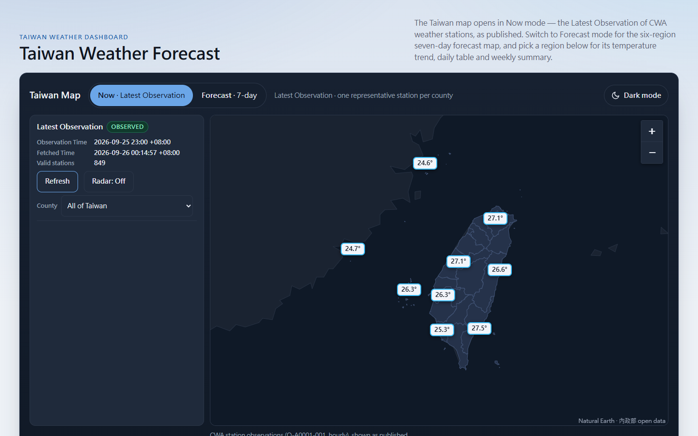
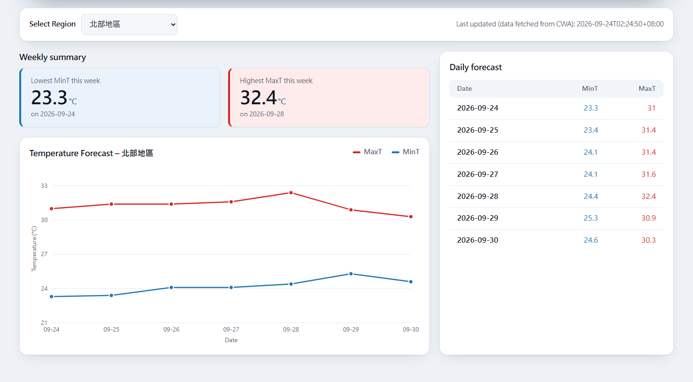

# HW01 — Taiwan Weather Forecast（台灣天氣預報）

## 專案資料

- **課程名稱**：AIoT 與數據分析（AIoT & Data Analytics, AIoT-DA）
- **作業**：HW10 Taiwan Weather Forecast — CWA API × JSON × Python × SQLite × Streamlit（題目：Part 5. AI Vibe coding 天氣預測 Forecast with CWA API）
- **完成日期**：2026-09-24 V1（評分主體）；2026-09-26 V2（Taiwan Map 的 Now mode、Radar）與 UI 改版
- **儲存庫網址**：[github.com/yotsubamomo/aiot-classwork](https://github.com/yotsubamomo/aiot-classwork)（本作業在 `home_work_01/`）
- **Live Demo**：[aiot-hw01-weather.vercel.app](https://aiot-hw01-weather.vercel.app)

## Live Demo

[](https://aiot-hw01-weather.vercel.app)

> 點擊圖片可開啟 Live Demo。截圖來自本機驗證環境（使用已提交的 CWA 樣本資料），所以觀測時間與數值和線上不同；線上版顯示 CWA 最近一次發布的測站觀測。



## 專案摘要

一個產品、兩個呈現層：

- **評分主體（Part A）**：從 CWA open data 取得一週預報 JSON，推導台灣六大區域 × 七個 Forecast Day 的每日最低溫（MinT）與最高溫（MaxT），存入 SQLite `data.db`，再由 Streamlit 應用程式 [`app.py`](app.py)（`streamlit run app.py`）提供 `Select Region` 下拉選單、一週折線圖與表格。
- **公開部署的 dashboard**：Flask 後端＋靜態前端部署於 Vercel，提供同一套 Region 查詢，另加互動式 **Taiwan Map**——Now mode 顯示 CWA 測站的最新觀測（Latest Observation），Forecast mode 是老師 Part A 的加分台灣地圖。

兩個呈現層讀同一份 `data.db`，經同一個共用查詢模組 [`weather_query.py`](weather_query.py)；應用程式本身不呼叫預報 API。

## 已實作功能

**資料管線（評分主體）**

- 以 `requests` 呼叫 CWA API 取得 JSON，完整、縮排地存成 [`data/raw/F-D0047-091.json`](data/raw/F-D0047-091.json)，終端機印出取得摘要與 42 列推導結果預覽。
- 解析 JSON，依專案定義的六區對照推導每區每日 MinT／MaxT；缺縣市、缺半日、數值無法解析等狀況一律明確報錯、不寫入資料庫。
- 以老師的 DDL 逐字建立 `TemperatureForecasts`；重跑 ingestion 以單一交易整批取代，永遠是 0 或 42 列、不重複。
- 可離線從已存的 JSON 重建 `data.db`（不連網、不需金鑰），並保留原始取得時間。

**Streamlit 評分應用程式（`app.py`）**

- `Taiwan Weather Forecast` 標題、`Select Region` 下拉選單（六區固定順序）。
- 所選區域一週 `MaxT`／`MinT` 折線圖與 `Date`／`MinT`／`MaxT` 表格（7 列），資料只以 SQL 從 `data.db` 查詢。
- 顯示資料取得時間；資料庫缺漏或不完整時顯示明確訊息。

**部署的 dashboard（Flask＋Vercel，ENHANCED）**

- 同樣的 Region 查詢：週摘要（本週最低 MinT、最高 MaxT）、MinT–MaxT 溫差帶與本週極值標記的折線圖、每日表格。
- **Taiwan Map — Now mode**（預設）：每縣最多一個代表測站的最新觀測氣溫；可點選縣市看該縣全部測站、最高／最低測站與測站詳情，`Back to Taiwan` 回到全台。
- **Refresh 與狀態**：只有手動 `Refresh` 會更新；失敗時保留上次成功的資料並標示 **Stale**，完全沒有資料時標示 **Unavailable**，只影響觀測圖層。
- **Radar overlay**：`Radar: Off／On` 切換 CWA 雷達回波圖，並顯示獨立的 `Radar Time`。
- **Taiwan Map — Forecast mode**：老師 Part A 的加分地圖（見 [Forecast mode — 老師 Part A 的加分地圖](#forecast-mode--老師-part-a-的加分地圖)）。
- 地圖只能在台灣範圍內拖曳（含澎湖、金門、連江），縮放 6–12 級。
- 響應式版面：桌機地圖為主視覺；375 px 手機為上方狀態列＋可關閉的底部資訊面，所有控制 ≥ 44 × 44 px。
- **Dark mode** 切換（地圖標題列右側）：預設跟隨系統，選擇記在瀏覽器；地圖區兩種模式都維持深色。

## 作業要求對應

| 配分項目（Part A 海報） | 配分 | 本專案 |
| --- | --- | --- |
| 1. 取得 CWA API 資料 | 20% | [`ingestion/fetch.py`](ingestion/fetch.py)：`requests` 取得 JSON、`json.dumps(indent=2)` 存檔供觀察。原指定的 `F-A0010-001` 已被 CWA 下架，改用相容替代資料集（見下方「資料來源與標示」）。 |
| 2. 分析 JSON，提取氣溫 | 20% | [`ingestion/derive.py`](ingestion/derive.py)：解析結構並推導每區每日 MinT／MaxT。 |
| 3. 存入 SQLite | 20% | [`ingestion/persist.py`](ingestion/persist.py)、[`data.db`](data.db)：`TemperatureForecasts`（老師 DDL 逐字），可用海報的兩段驗證 SQL 查詢。 |
| 4. Streamlit Web App | 40% | [`app.py`](app.py)：下拉選單、折線圖與表格、只從 SQLite 以 SQL 查詢。 |
| 5. 進階：台灣地圖視覺化 | 加分 | dashboard 的 **Forecast mode**：六區標記依當日推導溫度分四色、資訊卡、`Select Date`。 |

- **Part B**（老師的 Windy 設計文件）：其中「測站觀測地圖」的構想經明確決定採用，做成 V2 的 Now mode；FastAPI、React／Next.js、Windy 等架構維持參考／未來項目，沒有實作。
- 地圖以瀏覽器端 Leaflet 繪製（取代海報建議的 Folium），Streamlit 評分應用程式依設計不含地圖。

## 資料來源與標示

本專案顯示兩種**不同性質**的資料，在頁面上分開標示、不共用面板、圖例或色階：

| | 最新觀測（Now mode） | 預報值（Forecast mode、下方 dashboard、Streamlit） |
| --- | --- | --- |
| 性質 | CWA 測站觀測，**依 CWA 發布原樣**（標示 `OBSERVED`） | **專案推導**的相容性數值（標示 `DERIVED`／`PROJECT-DERIVED COMPATIBILITY VALUES`） |
| 資料集 | O-A0001-001，訪客開啟或按 `Refresh` 時由本站伺服器取得 | F-D0047-091，由 ingestion 取得一次並存入 `data.db` |
| 顯示時間 | `Observation Time`（CWA 觀測時間）與 `Fetched Time`（本站伺服器取得的時間） | `Last updated (data fetched from CWA)`：預報快照的取得時間 |

預報值的來源與限制（請先讀）：

- **原指定資料集**：CWA `F-A0010-001`（一週農業氣象預報，海報指定的六區一週預報）。**CWA 已於 2026-07-01 下架**（以有效金鑰查詢回傳 HTTP 404），這是外部限制，不是專案選擇。
- **相容替代**：CWA `F-D0047-091`（臺灣各縣市鄉鎮未來1週逐12小時天氣預報），**縣市層級**資料；採用它是專案的相容性決定，不是老師的指示。
- **Forecast Day（W1 視窗）**：以每個 12 小時時段 `StartTime` 的當地日期 D 分組，Forecast Day D ＝ `D 06:00–18:00` 加 `D 18:00–(D+1) 06:00`。這是**相容性視窗，不是日曆日**，兩個時段都在才算完整。
- **六區對照由專案定義**，不是 CWA 的權威分區：北部地區（基隆市、臺北市、新北市、桃園市、新竹市、新竹縣、苗栗縣）、中部地區（臺中市、彰化縣、南投縣、雲林縣、嘉義市、嘉義縣）、南部地區（臺南市、高雄市、屏東縣）、東北部地區（宜蘭縣）、東部地區（花蓮縣）、東南部地區（臺東縣）；澎湖縣、金門縣、連江縣不屬於任何區。
- **區域 MinT／MaxT 是 `PROJECT-DERIVED COMPATIBILITY VALUES`**：縣市每日 MinT 取當日各時段最低值、MaxT 取最高值，再對區內縣市取算術平均，四捨五入到一位小數。它們**不是** CWA 發布的六區預報。
- **Derived Map Temperature** 是**導出值** `(MinT + MaxT) / 2`（四捨五入到一位小數），**不是**觀測的日平均溫度。
- **Streamlit 的定位**：`app.py` 是老師指定、必須的評分產物，在本機以 `streamlit run app.py` 執行；它不是部署的 runtime，因為部署平台 Vercel 無法執行 Streamlit 伺服器——這是平台限制造成的相容性安排，不代表 Streamlit 不在作業範圍內。

最新觀測則是個別測站的讀數：不做平均或合併，代表測站的標記就是那一個測站的值，從不代表「縣市的氣溫」。

### CWA 資料授權標示

本專案顯示的資料為中央氣象署開放資料，依 **政府資料開放授權條款（Open Government Data License）** 使用：

| 使用位置 | 標示 |
| --- | --- |
| Now mode — 最新觀測 | **交通部中央氣象署 氣象觀測站-全測站逐時氣象資料（O-A0001-001）** |
| Now mode — Radar overlay | **交通部中央氣象署 雷達整合回波圖-臺灣(鄰近地區)_透明底圖（O-A0058-006）** |
| 預報值（ingestion、`data.db`、Forecast mode、dashboard、Streamlit） | **交通部中央氣象署 臺灣各縣市鄉鎮未來1週逐12小時天氣預報（F-D0047-091）**，顯示的數值由此推導 |

地圖底圖另有 Natural Earth（public domain）與內政部縣市界線（政府資料開放授權條款），出處見[技術參考](README.technical-reference.md#forecast-mode--the-part-a-bonus-map-six-region-taiwan-map-and-select-date)。

## Taiwan Map 的兩種模式

地圖標題列的 **Now**／**Forecast** 兩個按鈕切換模式；頁面一律以 Now mode 開啟，切回來時保留原本的視野、縣市與測站選擇。

### Now mode — 最新觀測（Latest Observation）

- **來源與節奏**：CWA open data **O-A0001-001**（氣象觀測站-全測站逐時氣象資料），CWA 描述為逐時的測站資料；何時發布新的一小時由 CWA 決定，所以顯示的 `Observation Time` 是資料的觀測時間，不是你看頁面的時間。
- **面板**：`Observation Time`、`Fetched Time`、有效測站數與 `Refresh`；只有手動 `Refresh` 會取新資料，頁面不自動更新、不輪詢。
- **代表測站**：全台視圖每縣最多一個標記，規則可依 API 回應手算（見技術參考摘要）。
- **縣市 → 測站**：點選地圖上的縣市或用 `County` 選單，列出該縣全部有效測站、最高與最低測站；只呈現測站值與測站數，不計算任何縣市平均。
- **Radar**：`Radar: Off` 按鈕疊上 CWA 雷達回波圖，顯示獨立的 `Radar Time`；雷達的失敗只影響雷達，不影響觀測或預報。

### Forecast mode — 老師 Part A 的加分地圖

- 按 **Forecast** 進入：六個區域以溫度標記顯示在專案定義的代表位置，標記文字是所選日期的 Derived Map Temperature，顏色依四段色帶：`< 20` 藍、`20 – < 25` 綠、`25 – < 30` 黃、`≥ 30` 紅；圖例附「derived, not observed」說明。
- **`Select Date`** 在地圖的資訊面板內，列出快照的七個 Forecast Day；切換日期會重新上色並更新面板的 `Date`／`Min`／`Max` 與導出平均，不重設地圖視野。
- 資料來自 `GET /api/days` 與 `GET /api/days/<date>`；導出值與色帶只在共用模組計算一次，前端不重算。

## 技術棧

| 層 | 使用技術 |
| --- | --- |
| 資料取得與推導 | Python 3.12、`requests`、`json`（[`ingestion/`](ingestion/) 套件：fetch → derive → persist） |
| 資料庫 | SQLite（[`data.db`](data.db)，部署時唯讀開啟） |
| 評分應用程式 | Streamlit（[`app.py`](app.py)） |
| 共用查詢／領域模組 | [`weather_query.py`](weather_query.py)：唯一持有 SQL 與預報商業邏輯的地方 |
| Dashboard 後端 | Flask（[`server.py`](server.py)），伺服器端觀測 [`observation.py`](observation.py)、代表測站 [`representative.py`](representative.py)、雷達 [`radar.py`](radar.py) |
| Dashboard 前端 | 靜態 HTML／CSS／JavaScript，無建構步驟；Leaflet 1.9.4 與向量底圖以本地檔案提供；圖表為 inline SVG，無 chart library |
| 部署 | Vercel（單一 Python serverless function，[`vercel.json`](vercel.json)、[`api/index.py`](api/index.py)） |
| 測試與 CI | `pytest`（完全離線）、Chrome DevTools 瀏覽器檢查腳本、GitHub Actions |

## 專案結構

```text
home_work_01/
├── README.md                        # 本檔：專案說明
├── README.technical-reference.md    # 完整技術參考（API、規則、部署、測試細節）
├── CONTEXT.md                       # 專案語彙
├── requirements.txt / .python-version / .env.example
├── ingestion/                       # fetch.py → derive.py → persist.py，pipeline.py（python -m ingestion）
├── data/raw/                        # 已提交的 F-D0047-091 原始 JSON 與取得時間 sidecar
├── data.db                          # SQLite：TemperatureForecasts（42 列）＋ IngestionMetadata
├── weather_query.py                 # 共用查詢／領域模組
├── app.py                           # Streamlit 評分應用程式
├── server.py                        # Flask dashboard 與 /api/
├── observation.py / representative.py / radar.py   # V2：最新觀測、代表測站、雷達
├── static/                          # index.html、styles.css、app.js、theme.js、vendor/（Leaflet）、data/（底圖、縣市名）
├── api/index.py · vercel.json       # Vercel serverless 入口與路由
├── smoke.py                         # 部署 smoke check
├── tools/credential_scan.py         # CI 的憑證掃描
├── tests/                           # 離線 pytest、fixtures、瀏覽器檢查腳本 check_*_browser.py
└── doc/                             # 題目、brief、spec、票務索引、驗收與治理紀錄
```

與海報 `HW10_Weather/` 建議結構的對應：

| 海報 `HW10_Weather/` | 本專案 |
| --- | --- |
| `fetch_weather.py`（取得 CWA API 資料） | [`ingestion/fetch.py`](ingestion/fetch.py) |
| `parse_weather.py`（分析 JSON，提取氣溫） | [`ingestion/derive.py`](ingestion/derive.py) |
| `database.py`（儲存到 SQLite） | [`ingestion/persist.py`](ingestion/persist.py) |
| （執行入口） | [`ingestion/pipeline.py`](ingestion/pipeline.py) — `python -m ingestion` |
| `app.py`（Streamlit） | [`app.py`](app.py)，經 [`weather_query.py`](weather_query.py) 讀取 |
| `data.db` / `requirements.txt` / `README.md` | [`data.db`](data.db) / [`requirements.txt`](requirements.txt) / 本檔 |
| （部署的 web app） | [`server.py`](server.py)＋[`static/`](static/)＋[`api/index.py`](api/index.py)＋[`vercel.json`](vercel.json) |
| `weather_data.csv`（可選） | 未使用 |

## 本機執行

以下指令都在 `home_work_01/` 目錄執行。

**1. 建立環境（Python 3.12）**

```bash
python -m venv .venv
.venv\Scripts\activate          # Windows
source .venv/bin/activate       # macOS / Linux
pip install -r requirements.txt
```

**2. 取得 CWA 金鑰並建立 `.env`**：到 <https://opendata.cwa.gov.tw/> 註冊取得自己的金鑰，然後

```bash
cp .env.example .env            # 再編輯 .env，設定 CWA_API_KEY=<你的金鑰>
```

**3. 執行 ingestion**

```bash
python -m ingestion                                        # 線上：取得、推導並寫入 data.db
python -m ingestion --from-json data/raw/F-D0047-091.json  # 離線：從已存的 JSON 重建（不連網、不需金鑰）
```

**4. 啟動 Streamlit 評分應用程式**

```bash
streamlit run app.py
```

**5. 啟動 dashboard（Flask）**

```bash
python server.py                # http://127.0.0.1:5000/
```

`python server.py` 會從 `.env` 讀取 `CWA_API_KEY` 供 Now mode 與 Radar 使用；沒有金鑰時 Now mode 顯示 "Latest Observation unavailable"，Forecast mode、下方 dashboard 與 `/api/health` 照常運作。

**6. 驗證資料庫與執行測試**

```sql
SELECT DISTINCT regionName FROM TemperatureForecasts;                -- 六列
SELECT * FROM TemperatureForecasts WHERE regionName = '中部地區';     -- 七列
```

```bash
pytest                          # 完全離線，不連網、不讀 .env
```

瀏覽器層級的檢查（需要本機 Chrome 與 `websocket-client`）另外執行，例如 `python tests/check_modes_browser.py`；清單見[技術參考](README.technical-reference.md#run-the-tests-offline)。

## 部署（Vercel）

- Dashboard 以**單一 Python serverless function** 部署：[`vercel.json`](vercel.json) 把所有請求導向 [`api/index.py`](api/index.py)，`data.db` 一起打包並唯讀開啟，[`.python-version`](.python-version) 固定 Python 3.12。
- Vercel 專案 **aiot-hw01-weather** 的 **Root Directory ＝ `home_work_01`**，由 repository owner 設定。
- **Preview／Production**：每個推上的 commit 都會自動建立一個公開的 preview 部署；**Production**（<https://aiot-hw01-weather.vercel.app>）只在合併進 `main` 時更新。
- **Smoke check**：`python smoke.py https://aiot-hw01-weather.vercel.app` 檢查 `GET /`（含 `Taiwan Weather Forecast`）與 `GET /api/health`（`status: "ok"`），最多重試 90 秒；GitHub Actions 另有手動觸發的 smoke workflow。

## 安全性：`CWA_API_KEY`

- 金鑰**只在伺服器端**於請求時讀取，從不傳到瀏覽器、回應、log 或任何被追蹤的檔案。
- **本機**：放在未追蹤的 `home_work_01/.env`（git 只追蹤只有變數名的 `.env.example`）。
- **Vercel**：只由 repository owner 在 Vercel 專案 **Settings → Environment Variables** 新增 **`CWA_API_KEY`**，適用 **Production** 與 **Preview**，存檔後重新部署；值不寫進 repo、issue、PR、log 或截圖，也不使用 `vercel env pull`。
- 只有 Latest Observation 與 Radar 兩個 endpoint 需要金鑰；預報部分、`/api/health`、離線 ingestion、Streamlit 與所有測試都不需要。
- CI 會執行憑證掃描（[`tools/credential_scan.py`](tools/credential_scan.py)）：確認 git 沒有追蹤 `.env`、提交內容與歷史中沒有金鑰格式字串。

## 技術參考摘要

以下是部署 dashboard 的規則與介面摘要；每一節的完整說明在 [`README.technical-reference.md`](README.technical-reference.md)。

<details>
<summary><b><code>/api/</code> endpoints、失敗代碼、逾時與重用視窗</b></summary>

| Endpoint | 成功回應 | 錯誤 |
| --- | --- | --- |
| `GET /api/health` | `200` `{ status: "ok", region_count: 6, forecast_day_count: 7, ingestion_time }` | `503` 快照缺漏／不完整 |
| `GET /api/regions` | `200` 六區名稱（固定順序） | `503` |
| `GET /api/regions/<region>/series` | `200` 七列 `{ dataDate, mint, maxt }` | `404` 未知區域；`503` |
| `GET /api/days`、`GET /api/days/<date>` | 七個 Forecast Day；某日六區的 `mint`、`maxt`、`derivedMapTemperature`、`colourBand` | `404` 未知日期；`503` |
| `GET /api/observations/latest` | `200` `{ dataset, observationTime, fetchedTime, validStationCount, receivedStationCount, stations[], representativeStationIds }`；每個測站含 `stationId`、名稱、縣市、鄉鎮、經緯度、`observationTime`、`airTemperature` 與可為 `null` 的濕度、風速、風向、氣壓、降水、天氣 | 見下表 |
| `GET /api/radar/latest` | `200` `image/png`，標頭 `X-Radar-Time`（CWA 產品時間）、`X-Radar-Fetched-Time`、`X-Radar-Dataset` | 見下表 |

觀測與雷達的失敗回應都是 JSON `{ dataset, reason, error }`，`reason` 恰為一個：

| `reason` | HTTP | 情況 |
| --- | --- | --- |
| `key_not_configured` | `503` | 伺服器沒有 `CWA_API_KEY`（不發出上游請求） |
| `upstream_unreachable` | `504` | 連線失敗，或上游未在時限內完成 |
| `upstream_error` | `502` | CWA 回應非 2xx（附 `upstreamStatus`） |
| `invalid_response` | `502` | CWA 回應 2xx 但內容不可用（非 JSON、結構不符、無有效測站、非預期的雷達產品） |

- **時限**：上游連線 3 秒、讀取 5 秒，整個上游交換上限 **8 秒**；頁面最多等 **20 秒**。
- **重用視窗**：成功的觀測回應重用 **300 秒**，雷達 **120 秒**；只重用成功結果，快取在 function 記憶體，不輪詢。

</details>

<details>
<summary><b>代表測站規則與地圖範圍外的測站</b></summary>

每縣的代表測站可從 `GET /api/observations/latest` 的回應手算（實作在 [`representative.py`](representative.py)，結果即 `representativeStationIds`）：

1. **候選**：該縣 `stations[]` 中，緯度在 **21.2 – 26.7**、經度在 **117.6 – 122.9**（台灣可用地圖範圍）內的測站。
2. **偏好測站**：該縣的偏好測站若是候選，它就是代表（偏好測站是專案資料，列在 `representative.py`，不是契約）。
3. **後備**：否則取 `stationId` 最小者（依字元碼比較，數字在大寫字母之前）。
4. **沒有候選就沒有標記**，這不是錯誤。

**地圖範圍外的測站**（例如高雄市的東沙島）不放在地圖上，但仍計入該縣的有效測站數、列在測站清單並標示 "not on the map"，也能開啟詳情。

</details>

<details>
<summary><b>地圖圍欄與縮放範圍</b></summary>

- 地圖只能在台灣可用範圍內拖曳：緯度 **21.2 – 26.7**、經度 **117.6 – 122.9**，涵蓋本島、澎湖、金門、連江、蘭嶼與綠島。
- 縮放 **6 – 12** 級：縮到最小時本島南北仍至少佔地圖高度的四分之一；放到最大時 1 km 約 28 px，可在測站最密的臺北市個別點選。
- 開啟時與 `Back to Taiwan` 後的視野包含整個本島與澎湖。

</details>

<details>
<summary><b>Radar overlay：來源、對齊方式與重新取得</b></summary>

- **來源**：CWA **O-A0058-006**（雷達整合回波圖-臺灣(鄰近地區)_透明底圖），3600 × 3600 PNG，涵蓋經度 118–124、緯度 20.5–26.5，每 10 分鐘發布。伺服器先以金鑰讀取 metadata，再取得 metadata 指向的 CWA 公開影像；瀏覽器只呼叫 `/api/radar/latest`。
- **對齊**：CWA 影像是等經緯度格網，地圖是 Web Mercator。整張影像直接拉伸會在中段偏差約 3.8 km，所以把影像切成 **24 條橫向條帶**（每條 0.25° 緯度）分別定位，每個像素與地圖投影的誤差遠小於 1 km（驗收標準是 1 km）。
- **重新取得**：只在**開啟雷達**時，或雷達顯示中按 **`Refresh`** 時取得；不輪詢。雷達時間比目前顯示更舊的影像不會取代它。雷達有自己的 Stale／Unavailable 狀態。
- **已知限制**：`Radar Time` 是 CWA 在 metadata 發布的產品時間，產品通常在該時間後數分鐘才可取得，所以通常比你看的時間早 5–15 分鐘；顯示中的雷達不會自己更新。

</details>

<details>
<summary><b>刻意不做的項目（V2 接受的 Later 清單）</b></summary>

獨立雨量圖層（O-A0002-001）、雷達動畫或歷史回放、heatmap、自動更新或輪詢、縣市篩選與測站搜尋、地圖狀態的 URL deep-link 與瀏覽器歷史、改用 10 分鐘資料集（O-A0003-001）、儲存觀測歷史、Windy、22 縣市預報、Streamlit 評分應用程式中的任何 V2 行為、公開 endpoint 的 rate limiting。

</details>

## 驗證紀錄

- `pytest`：625 個離線測試全數通過（推導、DDL 與驗證 SQL、冪等寫入、Streamlit `AppTest`、Flask API、觀測／雷達 endpoint、前端靜態檢查、憑證掃描）。
- 六個 Chrome 瀏覽器檢查腳本（modes、refresh、county、fence、radar、series error）＋ UI 版面檢查全數通過，涵蓋 1440／1280／1024／768／375 px。
- GitHub Actions：推送或 PR 涉及 `home_work_01/` 時執行 CI（離線測試＋憑證掃描）；production 部署後以 `smoke.py` 驗證。
- 逐條驗收：V1 [`doc/acceptance/ACCEPTANCE.md`](doc/acceptance/ACCEPTANCE.md)、V2 [`doc/acceptance/ACCEPTANCE-V2.md`](doc/acceptance/ACCEPTANCE-V2.md)。

## 詳細文件

| 文件 | 內容 |
| --- | --- |
| [`README.technical-reference.md`](README.technical-reference.md) | 完整技術參考：ingestion 細節、每個 endpoint 的欄位與哨兵值、Refresh／Stale 語義、Radar、部署步驟、測試與 CI 說明 |
| [`CONTEXT.md`](CONTEXT.md) | 專案語彙：Region、Forecast Day、Latest Observation、Observation Time、Fetched Time、Stale、Unavailable 等用詞定義 |
| [`doc/requirement/REQUIREMENTS.md`](doc/requirement/REQUIREMENTS.md) | 老師題目的逐條轉寫（Part A 海報、Part B 設計文件） |
| [`doc/spec/SPEC.md`](doc/spec/SPEC.md)、[`doc/spec/SPEC-V2.md`](doc/spec/SPEC-V2.md) | V1 與 V2 的實作 spec |
| [`doc/acceptance/`](doc/acceptance/) | 驗收清單與截圖證據 |
| [`doc/governance/`](doc/governance/) | Outcome Contract、決策紀錄、worklog、audit 與 run 紀錄 |
