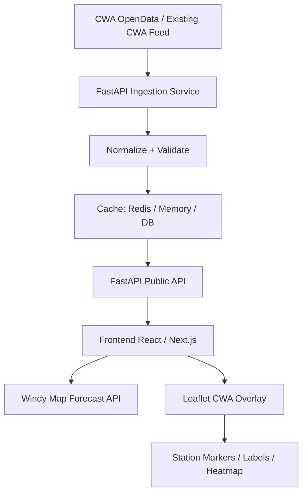

# 老師需求：Part 5. AI Vibe coding 天氣預測 Forecast with CWA API

- **來源**：[`Part_5._ai_vibe_coding_天氣預測forecast_with_cwa_api.pdf`](./Part_5._ai_vibe_coding_天氣預測forecast_with_cwa_api.pdf)（共 17 頁，第 17 頁空白）
- **內容組成**：PDF 由兩份材料構成
  - **Part A**：第 1 頁的作業海報圖片「HW10 Taiwan Weather Forecast」
  - **Part B**：第 1–16 頁的設計文件「Design: CWA Temperature Broadcast Visualization with Windy API」（老師的 grill 結果）
- **本文件的性質**：把上述兩份材料轉寫成可逐條對照的需求。只轉寫老師提出的內容，不補充老師沒有提出的要求；需求強度沿用原文用語（必須／should／建議／可選）。
- **未轉寫的內容**：原 PDF 第 1 頁印有老師的 CWA API 金鑰與另一組識別碼，屬於憑證，本文件不轉錄。依 Part A 注意事項第 1 條，作業必須使用自己的金鑰。

---

## Part A：HW10 Taiwan Weather Forecast（海報圖片）

### A.0 主題與學習目標

- **標題**：HW10 Taiwan Weather Forecast — CWA API × JSON × Python × SQLite × Streamlit
- **副標**：從氣象資料到互動式天氣預報應用程式（資料獲取・資料分析・資料儲存・資料查詢・視覺化展示）
- **資料流程**：

  ```text
  CWA Open Data (F-A0010-001)
    → JSON (7-day forecast)
    → Python (analysis & parsing)
    → SQLite (data.db)
    → Streamlit (web app)
    → Taiwan Weather Dashboard
  ```

- **學習目標**：
  1. 學會使用 Open Data API
  2. 掌握 JSON 資料結構分析
  3. 建立 SQLite 資料庫
  4. 使用 Streamlit 製作互動式 Web App
  5. 培養資料處理與視覺化能力

### A.1 取得 CWA API 資料（20%）

**目標**：使用 CWA API 取得台灣六大區域一週天氣預報（必須使用 JSON 格式）。

| 編號 | 需求 |
| --- | --- |
| A1-1 | 資料來源為 CWA Open Data，資料集 `F-A0010-001` |
| A1-2 | 回傳格式必須是 JSON |
| A1-3 | 涵蓋六個區域：北部地區、中部地區、南部地區、東北部地區、東部地區、東南部地區 |
| A1-4 | 預報範圍為一週 |
| A1-5 | 使用 `requests` 呼叫 CWA API |
| A1-6 | 使用 `json.dumps` 觀察回傳的 JSON 資料 |
| A1-7 | 確認資料取得成功 |

**海報範例程式**（URL 在海報中被截斷）：

```python
import requests, json
url = "https://opendata.cwa.gov.tw/api/v1/rest/datastore/F-A0..."
headers = {"Authorization": "YOUR_API_KEY"}
resp = requests.get(url, headers=headers, timeout=30)
data = resp.json()
print(json.dumps(data, indent=2, ensure_ascii=False))
```

**評分**：取得資料 10%｜觀察 JSON 5%｜程式品質 5%

### A.2 分析 JSON，提取氣溫資料（20%）

**目標**：分析 JSON 結構，找出並提取每日最高與最低氣溫。（Region 在資料中通常以 Location 表示）

| 編號 | 需求 |
| --- | --- |
| A2-1 | 分析 JSON 結構 |
| A2-2 | 提取每日最低氣溫（`MinT`）與最高氣溫（`MaxT`） |
| A2-3 | 以地區（location）為單位，每筆資料包含地區名稱、日期、最低溫、最高溫 |

**分析重點（海報示意的 JSON 結構）**：

```text
JSON
└ records
  └ locations
    └ location[]            （地區）
      └ weatherElement[]    （天氣要素）
        └ time[]            （預報日期）
          ├ elementName: MinT （最低溫）
          └ elementName: MaxT （最高溫）
```

**提取結果範例**：

| regionName | dataDate | mint | maxt |
| --- | --- | --- | --- |
| 北部地區 | 2026-04-14 | 18 | 26 |
| 中部地區 | 2026-04-14 | 20 | 30 |
| 南部地區 | 2026-04-14 | 22 | 31 |

**評分**：提取正確 10%｜觀察資料 5%｜程式品質 5%

### A.3 存入 SQLite 資料庫（20%）

**目標**：將氣溫資料儲存到 SQLite 資料庫。

| 編號 | 需求 |
| --- | --- |
| A3-1 | 資料庫檔案為 `data.db` |
| A3-2 | 資料表為 `TemperatureForecasts`，結構如下 |
| A3-3 | 能以 SQL 列出所有地區名稱 |
| A3-4 | 能以 SQL 查詢單一地區（例：中部地區）的資料 |

**資料庫設計**：

```sql
CREATE TABLE TemperatureForecasts (
  id INTEGER PRIMARY KEY,
  regionName TEXT,
  dataDate TEXT,
  mint REAL,
  maxt REAL
);
```

**驗證查詢**：

```sql
-- 1. 列出所有地區名稱
SELECT DISTINCT regionName FROM TemperatureForecasts;

-- 2. 查詢中部地區資料
SELECT * FROM TemperatureForecasts WHERE regionName = '中部地區';
```

**評分**：儲存資料 10%｜查詢驗證 5%｜程式品質 5%

### A.4 Streamlit 氣溫預報 Web App（40%）

**目標**：建立互動式 Web App，從 SQLite 查詢資料，提供下拉選單，顯示一週氣溫的折線圖與表格。

| 編號 | 需求 |
| --- | --- |
| A4-1 | 下拉選單選擇地區 |
| A4-2 | 使用 SQL 從 SQLite 查詢資料 |
| A4-3 | 顯示最高／最低溫折線圖 |
| A4-4 | 顯示一週資料表格 |

**海報範例程式**：

```python
import streamlit as st
import sqlite3
import pandas as pd

conn = sqlite3.connect("data.db")
# 使用 SQL 查詢資料
# 繪製折線圖與表格
```

**畫面範例（選擇地區顯示一週氣溫預報）**：

- 頁面標題：`Taiwan Weather Forecast`
- 下拉選單標籤：`Select Region`，範例選取「中部地區」
- 圖表標題：`Temperature Forecast – 中部地區`
- 折線圖：兩條線 `MaxT`（紅）與 `MinT`（藍）；Y 軸 `Temperature (°C)`，X 軸為 04/14–04/20 共 7 天
- 表格欄位：`Date`、`MinT`、`MaxT`，共 7 列：

  | Date | MinT | MaxT |
  | --- | --- | --- |
  | 2026-04-14 | 20 | 30 |
  | 2026-04-15 | 21 | 31 |
  | 2026-04-16 | 22 | 32 |
  | 2026-04-17 | 21 | 30 |
  | 2026-04-18 | 20 | 29 |
  | 2026-04-19 | 21 | 30 |
  | 2026-04-20 | 22 | 31 |

**評分**：下拉選單 10%｜折線圖與表格 15%｜SQLite 查詢 10%｜程式品質 5%

### A.5 進階：台灣地圖視覺化（Optional）

**目標**：製作互動式台灣地圖，顯示各區當日平均溫度。（建議使用 Folium + Streamlit）

| 編號 | 需求 |
| --- | --- |
| A5-1 | 互動式台灣地圖（範例有縮放 `+`／`−` 控制） |
| A5-2 | 地圖上標示六個區域：北部、東北部、中部、東部、南部、東南部 |
| A5-3 | 依各區當日平均溫度設定標記顏色 |
| A5-4 | 顯示單一地區的資訊卡（範例：`中部地區`、`Date: 2026-04-14`、`Min: 20°C`、`Max: 30°C`） |

**依平均溫度設定顏色**：

| 溫度 | 顏色 |
| --- | --- |
| < 20°C | 藍色 |
| 20–25°C | 綠色 |
| 25–30°C | 黃色 |
| > 30°C | 紅色 |

**評分**：海報未列配分；注意事項第 5 條說明為加分功能。

### A.6 專案結構建議

```text
HW10_Weather/
├ fetch_weather.py    # 取得 CWA API 資料
├ parse_weather.py    # 分析 JSON，提取氣溫
├ database.py         # 儲存到 SQLite
├ app.py              # Streamlit Web App
├ data.db             # SQLite 資料庫
├ weather_data.csv    # （可選）中間產物
├ requirements.txt
└ README.md
```

### A.7 執行方式

1. 建立虛擬環境（建議）

   ```bash
   python -m venv venv
   venv\Scripts\activate          # Windows
   source venv/bin/activate       # Mac/Linux
   ```

2. 安裝套件：`pip install -r requirements.txt`
3. 執行資料處理（一次即可）：

   ```bash
   python fetch_weather.py
   python parse_weather.py
   python database.py
   ```

4. 啟動 Web App：`streamlit run app.py`

### A.8 需要安裝的套件

`requests`、`pandas`、`streamlit`、`folium`、`streamlit-folium`

### A.9 重要注意事項

1. 使用自己的 CWA API Key，不能使用老師提供的金鑰繳交。
2. Streamlit 必須從 SQLite 查詢資料，不可直接呼叫 API。
3. 確認六個地區的資料都正確。
4. 表格與圖表需顯示一週（7 天）資料。
5. 進階的台灣地圖為加分功能，可在基本功能完成後再實作。

### A.10 配分總表

| 項目 | 配分 | 細項 |
| --- | --- | --- |
| 1. 取得 CWA API 資料 | 20% | 取得資料 10%、觀察 JSON 5%、程式品質 5% |
| 2. 分析 JSON，提取氣溫資料 | 20% | 提取正確 10%、觀察資料 5%、程式品質 5% |
| 3. 存入 SQLite 資料庫 | 20% | 儲存資料 10%、查詢驗證 5%、程式品質 5% |
| 4. Streamlit 氣溫預報 Web App | 40% | 下拉選單 10%、折線圖與表格 15%、SQLite 查詢 10%、程式品質 5% |
| 5. 進階：台灣地圖視覺化 | 加分 | 未列配分 |
| **合計** | **100%** | |

---

## Part B：Design — CWA Temperature Broadcast Visualization with Windy API（老師 grill 結果）

### B.1 專案概述

把台灣 CWA 氣溫觀測資料視覺化在 Windy 天氣地圖上。系統組成：

| 元件 | 角色 |
| --- | --- |
| CWA OpenData | 可信任的氣象觀測資料來源 |
| FastAPI | 後端 API 與資料正規化層 |
| Windy Map Forecast API | 互動式天氣地圖背景 |
| Leaflet overlay layers | 在 Windy 上繪製自訂的 CWA 氣溫資料 |

Windy Map Forecast API 以 Leaflet 1.4.x 為基礎，Windy 的 map 物件就是 Leaflet map instance，因此可用一般 Leaflet 功能在 Windy 地圖上畫 CWA 標記、標籤、popup 與 heatmap。

### B.2 目標（第一版需支援）

建立即時或近即時的台灣氣溫視覺化系統。

| 編號 | 需求 |
| --- | --- |
| B2-1 | 顯示以台灣為中心的 Windy 地圖 |
| B2-2 | 從後端 API 載入最新的 CWA 氣溫觀測 |
| B2-3 | 以依溫度著色的地圖標記繪製 CWA 測站氣溫 |
| B2-4 | Popup 顯示測站名稱、縣市、鄉鎮、氣溫、濕度、風與觀測時間 |
| B2-5 | 自動更新資料 |
| B2-6 | 提供溫度色階的簡易圖例 |
| B2-7 | 讓使用者切換 Windy 背景圖層，例如 wind、rain、clouds、temperature |

### B.3 Windy 與 Leaflet 的分工

- Windy 是**天氣脈絡圖層**，不是 CWA 資料的儲存或繪製引擎。
- Windy 提供：專業的天氣地圖背景、內建天氣 overlay、地圖控制、預報／天氣脈絡、風／雨／雲／溫度模式圖層。
- Leaflet 提供：自訂測站標記、自訂 CWA 氣溫標籤、popup、GeoJSON 支援、layer group、未來的 heatmap 或 canvas overlay。
- Windy 地圖本身提供縮放、拖曳、移動與點擊處理等互動。

### B.4 資料來源

#### B.4.1 CWA 觀測資料

CWA 自動氣象站資料集包含以下欄位：

`StationName`、`StationId`、`DateTime`、`StationLatitude`、`StationLongitude`、`StationAltitude`、`CountyName`、`TownName`、`Weather`、`Precipitation`、`WindDirection`、`WindSpeed`、`AirTemperature`、`RelativeHumidity`、`AirPressure`、`PeakGustSpeed`

資料每 1 小時更新，授權為政府資料開放授權條款第 1 版。

#### B.4.2 後端責任

前端不應直接依賴 CWA 原始格式。後端應：

| 編號 | 需求 |
| --- | --- |
| B4-1 | 取得或接收 CWA 資料 |
| B4-2 | 正規化欄位名稱 |
| B4-3 | 移除無效紀錄 |
| B4-4 | 把字串轉成數字 |
| B4-5 | 快取最新結果 |
| B4-6 | 對前端提供乾淨的 JSON API |

### B.5 架構



### B.6 建議技術

| 層 | 技術 |
| --- | --- |
| Backend | Python 3.11+、FastAPI、httpx、Pydantic、APScheduler 或 cron job、Redis cache（可選）、PostgreSQL/PostGIS（可選，用於歷史資料） |
| Frontend | Next.js 或 Vite + React、Windy Map Forecast API、Leaflet、TypeScript、Leaflet.markercluster（可選）、Leaflet.heat 或自訂 Canvas layer（可選） |

### B.7 後端模組

```text
backend/
  app/
    main.py
    config.py
    routers/
      temperature.py
      health.py
    services/
      cwa_client.py
      temperature_service.py
      cache_service.py
    schemas/
      temperature.py
    jobs/
      refresh_cwa_data.py
```

### B.8 後端資料模型

正規化後的氣溫觀測：

```python
from pydantic import BaseModel
from datetime import datetime

class StationTemperature(BaseModel):
    station_id: str
    station_name: str
    county: str | None = None
    town: str | None = None

    lat: float
    lon: float
    altitude_m: float | None = None

    observed_at: datetime
    temperature_c: float

    humidity_percent: float | None = None
    pressure_hpa: float | None = None
    wind_speed_mps: float | None = None
    wind_direction_deg: float | None = None
    precipitation_mm: float | None = None
    weather: str | None = None
```

### B.9 後端 API

| 編號 | Endpoint | 說明 |
| --- | --- | --- |
| B9-1 | `GET /api/temperature/latest` | 回傳所有有效的最新測站觀測 |
| B9-2 | `GET /api/temperature/geojson` | 以 GeoJSON 格式回傳，供 Leaflet 使用 |
| B9-3 | `GET /api/temperature/stations/{station_id}` | 回傳單一測站的最新詳細資料 |
| B9-4 | `GET /api/health` | 健康檢查 |

**B9-1 回應範例**：

```json
{
  "source": "CWA",
  "updated_at": "2026-07-02T09:00:00+08:00",
  "count": 1200,
  "stations": [
    {
      "station_id": "466920",
      "station_name": "臺北",
      "county": "臺北市",
      "town": "中正區",
      "lat": 25.0377,
      "lon": 121.5149,
      "observed_at": "2026-07-02T09:00:00+08:00",
      "temperature_c": 32.4,
      "humidity_percent": 67,
      "wind_speed_mps": 2.1
    }
  ]
}
```

**B9-2 回應範例**：

```json
{
  "type": "FeatureCollection",
  "features": [
    {
      "type": "Feature",
      "geometry": { "type": "Point", "coordinates": [121.5149, 25.0377] },
      "properties": {
        "station_id": "466920",
        "station_name": "臺北",
        "temperature_c": 32.4,
        "county": "臺北市",
        "town": "中正區",
        "observed_at": "2026-07-02T09:00:00+08:00"
      }
    }
  ]
}
```

**B9-4 回應範例**：

```json
{
  "status": "ok",
  "cwa_cache_status": "fresh",
  "latest_cwa_time": "2026-07-02T09:00:00+08:00"
}
```

### B.10 資料驗證規則

後端應移除或忽略符合下列任一條件的紀錄：

| 編號 | 條件 |
| --- | --- |
| B10-1 | 緯度或經度缺漏 |
| B10-2 | 氣溫缺漏 |
| B10-3 | 氣溫無法解析為數字 |
| B10-4 | 氣溫超出合理範圍，例如 `< -20°C` 或 `> 50°C` |
| B10-5 | 測站 ID 缺漏 |
| B10-6 | 觀測時間無效 |

無效值規則要可設定，因為 CWA 不同產品編碼缺值的方式可能不同。範例：

```python
INVALID_VALUES = {"", "X", "NA", "null", None, "-99", "-999"}

def parse_float(value):
    if value in INVALID_VALUES:
        return None
    try:
        return float(value)
    except ValueError:
        return None
```

### B.11 前端結構

```text
frontend/
  src/
    components/
      WindyMap.tsx
      TemperatureLayer.tsx
      TemperatureLegend.tsx
      StationPopup.tsx
      LayerControlPanel.tsx
    lib/
      windyLoader.ts
      cwaApi.ts
      colorScale.ts
    types/
      temperature.ts
```

### B.12 Windy 地圖初始化

- 先載入 Leaflet，再載入 Windy 的 `libBoot.js`。
- 頁面必須有一個掛載 Windy 的 `div`。
- 以 `windyInit(options, callback)` 初始化。

```html
<script src="https://unpkg.com/leaflet@1.4.0/dist/leaflet.js"></script>
<script src="https://api.windy.com/assets/map-forecast/libBoot.js"></script>

<div id="windy"></div>
```

```js
const options = {
  key: WINDY_API_KEY,
  lat: 23.7,
  lon: 121.0,
  zoom: 7,
  overlay: "wind",
  verbose: true
};

windyInit(options, windyAPI => {
  const { map, store } = windyAPI;
  store.set("overlay", "wind");
  // Add CWA layer here
});
```

### B.13 Windy 圖層控制

- `overlay`、`level`、`timestamp`、`product` 與粒子動畫等參數由 `windyAPI.store` 控制，支援 `.get()`、`.set()`、`.getAllowed()`。
- 建議預設：`store.set("overlay", "wind")`、`store.set("particlesAnim", "on")`
- 可用的 overlay：`"wind"`、`"temp"`、`"rain"`、`"clouds"`
- **重要設計**：Windy 的 `temp` 圖層是 Windy／模式的溫度視覺化；CWA overlay 是 CWA 測站的實際觀測。兩者不可混淆。

### B.14 CWA 氣溫圖層

- 測站標記使用 Leaflet `LayerGroup`。
- 每次載入時先 `clearLayers()` 再重畫。
- 每個測站以 `L.circleMarker` 繪製：`radius: getRadius(temperature_c)`、`fillColor: colorByTemperature(temperature_c)`、`fillOpacity: 0.85`、`color: "#ffffff"`、`weight: 1`。
- Popup 內容：測站名稱（粗體）、縣市與鄉鎮、`Temperature: {temperature_c}°C`、`Humidity: {humidity_percent ?? "-"}%`、`Wind: {wind_speed_mps ?? "-"} m/s`、`Time: {observed_at}`。

```js
let cwaLayer = L.layerGroup().addTo(map);

async function loadCwaTemperature() {
  const res = await fetch("/api/temperature/latest");
  const data = await res.json();

  cwaLayer.clearLayers();

  data.stations.forEach(station => {
    const marker = L.circleMarker([station.lat, station.lon], {
      radius: getRadius(station.temperature_c),
      fillColor: colorByTemperature(station.temperature_c),
      fillOpacity: 0.85,
      color: "#ffffff",
      weight: 1
    });

    marker.bindPopup(`
      <strong>${station.station_name}</strong><br/>
      ${station.county ?? ""} ${station.town ?? ""}<br/>
      Temperature: ${station.temperature_c}°C<br/>
      Humidity: ${station.humidity_percent ?? "-"}%<br/>
      Wind: ${station.wind_speed_mps ?? "-"} m/s<br/>
      Time: ${station.observed_at}
    `);

    marker.addTo(cwaLayer);
  });
}
```

### B.15 溫度色階（建議）

```ts
export function colorByTemperature(temp: number): string {
  if (temp < 10) return "#2b6cb0";
  if (temp < 15) return "#3182ce";
  if (temp < 20) return "#38a169";
  if (temp < 25) return "#ecc94b";
  if (temp < 30) return "#ed8936";
  if (temp < 35) return "#e53e3e";
  return "#9b2c2c";
}
```

| 範圍 | 圖例文字 |
| --- | --- |
| < 10°C | cold |
| 10–15°C | cool |
| 15–20°C | mild |
| 20–25°C | comfortable |
| 25–30°C | warm |
| 30–35°C | hot |
| > 35°C | very hot |

### B.16 自動更新

CWA 自動站資料每小時更新，前端可每 5–10 分鐘更新，後端快取每小時或稍頻繁更新。建議：

| 項目 | 建議值 |
| --- | --- |
| 後端更新間隔 | 每 10 分鐘 |
| 前端更新間隔 | 每 5 分鐘 |
| 顯示狀態 | 最新的 CWA 觀測時間 |

前端應**一律**顯示：`Last CWA update: YYYY-MM-DD HH:mm`

### B.17 Windy 事件處理

- Windy 會廣播 `mapChanged`、`paramsChanged`、`redrawFinished`、`metricChanged`、`uiChanged` 等事件。
- 要在 Windy 載入並繪製完成後執行自訂工作時，適合用 `redrawFinished`：

  ```js
  windyAPI.broadcast.on("redrawFinished", () => {
    console.log("Windy redraw finished");
  });
  ```

- 避免直接在 `paramsChanged` 裡執行繁重的繪製邏輯。

### B.18 效能設計

| 情境 | 做法 |
| --- | --- |
| 測站數少於 1,500 | 使用 `L.circleMarker`；使用單一 `LayerGroup`；更新時清除後重畫 |
| 資料點變多 | 使用 marker clustering；使用 Canvas renderer；簡化標籤；低縮放層級隱藏標籤；zoom >= 9 才顯示文字標籤 |
| Heatmap 模式 | 先做測站點 heatmap；之後有網格化 CWA 資料再使用；不可把內插後的測站資料宣稱為精確的地面實況 |

### B.19 UI 設計

**主版面**：

```text
┌─────────────────────────────────────────────┐
│ Top Bar                                     │
│ CWA Temperature Broadcast | Last update     │
├─────────────────────────────────────────────┤
│                                             │
│               Windy Map                     │
│         + CWA Temperature Overlay           │
│                                             │
├───────────────┬─────────────────────────────┤
│ Legend        │ Layer Control               │
│ Temp colors   │ Windy layer / CWA layer     │
└───────────────┴─────────────────────────────┘
```

**控制項**：

1. CWA overlay 開／關
2. 顯示測站標籤開／關
3. Windy 圖層選擇
4. 自動更新開／關
5. 縣市篩選
6. 溫度門檻篩選

### B.20 環境變數

```env
# Backend
CWA_API_KEY=your_cwa_api_key
CWA_DATA_URL=your_cwa_data_url
CACHE_TTL_SECONDS=600

# Frontend
NEXT_PUBLIC_WINDY_API_KEY=your_windy_api_key
NEXT_PUBLIC_API_BASE_URL=http://localhost:8000
```

Windy 的瀏覽器金鑰在前端程式中對使用者可見；CWA 金鑰應留在伺服器端。

### B.21 安全性

| 編號 | 需求 |
| --- | --- |
| B21-1 | 不可把 CWA API key 暴露給瀏覽器 |
| B21-2 | FastAPI 限制允許的 origins |
| B21-3 | 對公開 API 加上 rate limiting |
| B21-4 | 快取 CWA 資料，避免不必要的上游請求 |
| B21-5 | 不可把 secrets 存進 Git |
| B21-6 | 提供 `.env.example`，但永遠不 commit `.env` |

### B.22 錯誤處理

**後端**：CWA 取得失敗時使用快取資料並回報 stale：

```json
{
  "status": "stale",
  "message": "Using cached data because CWA fetch failed.",
  "latest_cwa_time": "2026-07-02T09:00:00+08:00"
}
```

**前端**：顯示友善訊息。

- CWA 資料失敗：`CWA data is temporarily unavailable. Showing the latest cached observation.`
- Windy 失敗：`Weather map failed to load. CWA station data is still available in table mode.`

### B.23 開發階段

| 階段 | 內容 |
| --- | --- |
| Phase 1: MVP | FastAPI endpoint `/api/temperature/latest`；以台灣為中心的 Windy 地圖；CWA 測站標記；溫度圖例；popup 詳細資料；手動更新按鈕 |
| Phase 2: Dashboard | 自動更新；縣市篩選；測站搜尋；Windy 圖層切換；測站標籤切換；健康檢查 endpoint |
| Phase 3: Advanced Visualization | Heatmap 模式；時間滑桿；歷史回放；網格化溫度圖層；警戒門檻著色；行動裝置友善 UI |
| Phase 4: Production | Redis cache；Postgres/PostGIS；API rate limiting；logging；monitoring；部署到 Vercel + Render/Fly.io/Railway 或自架伺服器 |

### B.24 MVP 驗收條件

系統完成的條件：

| 編號 | 條件 |
| --- | --- |
| B24-1 | 使用者開啟頁面能看到 Windy 地圖 |
| B24-2 | 地圖以台灣為中心 |
| B24-3 | 地圖上出現 CWA 測站氣溫標記 |
| B24-4 | 標記顏色隨氣溫變化 |
| B24-5 | 點擊標記顯示測站詳細資料 |
| B24-6 | 使用者能看到最新的 CWA 觀測時間 |
| B24-7 | 使用者能更新 CWA 資料 |
| B24-8 | 後端隱藏 CWA API key |
| B24-9 | CWA 資料缺漏時前端不會 crash |
| B24-10 | 專案附有清楚的安裝說明 |

### B.25 建議檔案結構

```text
cwa-windy-temperature/
  README.md
  design.md
  backend/
    app/
      main.py
      config.py
      routers/
        temperature.py
        health.py
      services/
        cwa_client.py
        temperature_service.py
        cache_service.py
      schemas/
        temperature.py
    requirements.txt
    .env.example
  frontend/
    src/
      components/
        WindyMap.tsx
        TemperatureLayer.tsx
        TemperatureLegend.tsx
        LayerControlPanel.tsx
      lib/
        cwaApi.ts
        colorScale.ts
        windyLoader.ts
      types/
        temperature.ts
    package.json
    .env.example
```

### B.26 實作注意事項

- **Backend**：用 FastAPI 隱藏上游 CWA 的複雜度。

  ```python
  @app.get("/api/temperature/latest")
  async def get_latest_temperature():
      data = await temperature_service.get_latest()
      return data
  ```

- **Frontend**：
  - Windy 只初始化一次。
  - 同一頁面不可建立多個 Windy map instance。
  - CWA 標記的繪製與 Windy 初始化分開。

  ```ts
  type WindyApi = {
    map: any;
    store: any;
    broadcast: any;
  };
  ```

### B.27 主要技術決策

```text
Windy Map Forecast API → 提供基礎天氣地圖與天氣脈絡
Leaflet custom overlay → 繪製 CWA 測站氣溫資料
FastAPI                → 取得、清理、驗證、快取並提供 CWA 資料
```

這比把 CWA 資料塞進 Windy 原生的 `temp` overlay 更好。

### B.28 未來構想（非本次需求）

1. 比較 CWA 觀測氣溫與 Windy 模式氣溫
2. 顯示測站異常值
3. 顯示最熱的前 10 個測站
4. 顯示縣市平均氣溫
5. 加入颱風／雨／風 overlay 模式
6. 語音播報模式（例：「Current hottest area is Tainan, 35.2°C.」）
7. 課堂模式：學生檢視觀測資料、比較測站與模式、學習內插與天氣視覺化

---

## 附錄：Part A 與 Part B 的差異

兩份材料描述的系統不同，以下只列出事實差異，取捨在 spec 決定。

| 面向 | Part A（HW10 海報） | Part B（grill 設計） |
| --- | --- | --- |
| CWA 資料集 | `F-A0010-001` 六大區域一週預報 | 自動氣象站觀測資料（每小時更新） |
| 資料粒度 | 6 個區域 × 7 天，最低溫／最高溫 | 各測站即時觀測（氣溫、濕度、風、氣壓、雨量…） |
| 儲存 | SQLite `data.db`，資料表 `TemperatureForecasts` | 快取：Redis／Memory／DB；PostgreSQL/PostGIS 為可選 |
| 後端 | Python 腳本（fetch／parse／database） | FastAPI 服務 |
| Web App | Streamlit（**必須**從 SQLite 查詢，不可直接呼叫 API） | Next.js 或 Vite + React + TypeScript |
| 地圖 | 可選，建議 Folium + Streamlit | Windy Map Forecast API + Leaflet overlay |
| 地圖內容 | 六區當日平均溫度，4 段色階 | 各測站觀測氣溫，7 段色階 |
| 配分 | 明確配分，合計 100%，地圖為加分 | 無配分，以 MVP 驗收條件定義完成 |
