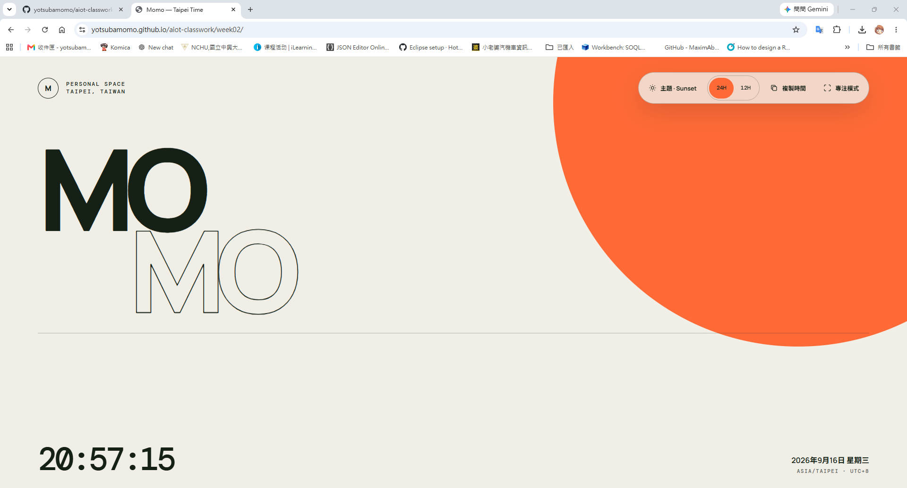

# DIC-1 — 個人入口網站與動態時鐘

## 專案資料

- **課程名稱**：AIoT 與數據分析（AIoT & Data Analytics, AIoT-DA）
- **課堂實作**：DIC-1（Do in Class 1）— 個人入口網站與動態時鐘
- **授課單元**：Lecture 2 — 瀏覽器、現代 Web 核心與非同步資料流（L2Web）
- **示範教師**：Huan Chen
- **網站顯示名稱**：Momo
- **完成日期**：2026-09-16
- **儲存庫網址**：[github.com/yotsubamomo/aiot-classwork](https://github.com/yotsubamomo/aiot-classwork)
- **Live Demo Page**：[yotsubamomo.github.io/aiot-classwork/week02/](https://yotsubamomo.github.io/aiot-classwork/week02/)

## Live Demo Snapshot

[](https://yotsubamomo.github.io/aiot-classwork/week02/)

> 點擊圖片可開啟 Live Demo。

## 專案摘要

DIC-1 使用零框架、零建構依賴的 Vanilla HTML、CSS 與 JavaScript，建立可直接部署至 GitHub Pages 的個人入口網站。網站以 `Momo` 為公開顯示名稱，所有日期與時間固定依照 `Asia/Taipei` 計算，不受訪客裝置時區影響。

本次完成的核心功能包括：

- 即時顯示台北日期與時鐘，連續更新並附毫秒與 UNIX timestamp。
- 以 SVG 進度環顯示這一分鐘走了多少，60 秒填滿一圈後歸零。
- 依台北時段變化的問候徽章，以及 ISO 週數與年積日標籤。
- 名稱與標語可直接在頁面上編輯，Enter 或失焦送出、`Esc` 取消，頭像縮寫同步更新。
- 串接 Open-Meteo 顯示目前氣溫與天氣，可切換台中、台北、新竹、台南、高雄；取不到資料時顯示上次讀數並標示離線。
- 支援 24 小時制及附 AM／PM 的 12 小時制。
- 右側滑出的抽屜收納 Projects／About／Connect 三個分頁，Hero 維持乾淨；可用遮罩、關閉鈕或 `Esc` 關閉。
- 專案卡片由 `projects.json` 非同步載入後動態產生，新增作品只要改資料檔，不必動版面。
- 提供 `Aurora`、`Minimal`、`Sunset` 三套視覺主題；主題只改變配色、背景與光影，不改變內容結構。
- 使用瀏覽器儲存空間保留主題與時間格式偏好。
- 可複製包含名稱、完整日期、時間與 `Asia/Taipei (UTC+8)` 的文字時間戳，並顯示短暫成功提示。
- 提供暫時性的專注模式，只保留名稱、時鐘、日期及退出控制；可按 `Esc` 離開且不保存模式狀態。
- 介面文字為英文，搭配語意化按鈕、ARIA 標示、清楚的鍵盤焦點與 reduced-motion 支援。
- 響應式版面支援桌面與手機，不需要安裝套件或執行建構流程。

## 專案結構

```text
week02/
├── README.md         # 本檔：DIC-1 的專案說明
├── BRIEF.md          # 與課程規格的落差盤點
├── SPEC.md           # 補齊規格的實作 spec
├── CONTEXT.md        # DIC-1 的專案語彙與已確認行為邊界
├── home.jpg          # Live Demo 畫面截圖
├── index.html        # 語意化頁面結構
├── projects.json     # 專案目錄資料，卡片由此動態產生
├── style.css         # 設計 token、三套主題與響應式版面
├── app.js            # DOM 事件、偏好讀寫與畫面更新
├── core.js           # 純邏輯，可被瀏覽器與 Node 共用
└── tests/
    └── core.test.js  # core.js 的行為測試
```

### 核心檔案

| 檔案 | 用途 |
| --- | --- |
| [`CONTEXT.md`](./CONTEXT.md) | 定義顯示名稱、台北時間、時間格式、視覺主題、保存偏好、專注模式與複製時間。 |
| [`index.html`](./index.html) | 語意化頁面結構，只負責 markup。 |
| [`style.css`](./style.css) | 設計 token、三套視覺主題、響應式版面與無障礙樣式。 |
| [`app.js`](./app.js) | 所有副作用：DOM 選取與事件、localStorage 讀寫、剪貼簿、時鐘更新。 |
| [`core.js`](./core.js) | 純邏輯：時間格式化、日期文字、日曆計算、主題循環、狀態與專案資料正規化。不碰 DOM、儲存與網路。 |
| [`projects.json`](./projects.json) | 專案目錄。頁面沒有任何寫死的專案內容，新增作品只要改這個檔案。 |

## 測試

`core.js` 是唯一的測試接縫，測試用 Node 內建的執行器，不需要安裝任何套件：

```powershell
node --test
```

在 `week02` 目錄下執行。瀏覽器端仍然零依賴——沒有 `node_modules`，也沒有建構步驟。

## 技術重點

### 固定台北時區

時鐘透過 `Intl.DateTimeFormat` 並明確指定 `Asia/Taipei`，因此即使訪客位於其他國家，仍會顯示正確的台北時間。

### 三套視覺主題

三個主題共用相同的 Editorial Hello 版面與資訊架構，僅透過 CSS Custom Properties 改變視覺 presentation：

- **Aurora**：深色 Cyber Ambient，青綠與紫色的發光球緩慢漂移，也是首次造訪的預設主題。
- **Minimal**：高對比、克制的黑白視覺。
- **Sunset**：暖灰背景與橘色圓形主視覺。

### 單一狀態樹

所有偏好合併成一個物件，序列化後存在 `localStorage` 的 `aiot_user_state`，就是以下七個欄位，不多也不少：

```json
{
  "name": "Momo",
  "tagline": "AIoT & Data Analytics",
  "theme": "aurora",
  "format24h": true,
  "soundEnabled": false,
  "selectedCity": "taichung",
  "zenMode": false
}
```

天氣讀數另外存在 `aiot_weather_cache`，刻意與上面七個欄位分開，不污染規格定義的狀態樹。

讀取時每個欄位各自驗證：型別錯誤、超出允許值或缺少的欄位回退到預設，未知欄位丟棄，因此手動竄改儲存內容不會讓頁面壞掉。儲存空間被封鎖時網站完全照常運作，只是設定不會保存。目前時間與操作提示屬於瞬時狀態，不在保存範圍內。

## 本機預覽

本專案為純靜態網站，不需安裝 `node_modules`。從 `week02` 目錄啟動本機伺服器：

```powershell
python -m http.server 5173
```

接著開啟：<http://localhost:5173>

**必須透過本機伺服器開啟，不能直接雙擊 `index.html`。** 瀏覽器會擋下 `file://` 協定的 ES module 載入（以及之後要加入的 `fetch`），從檔案總管直接打開會看到沒有互動的靜態畫面。GitHub Pages 上則一切正常。

## GitHub Pages

網站不依賴伺服器端程式或絕對資源路徑。當此儲存庫的 GitHub Pages 從 `main` 分支根目錄發布後，DIC-1 位於：

<https://yotsubamomo.github.io/aiot-classwork/week02/>

## 驗證紀錄

- JavaScript 語法檢查通過。
- 實際瀏覽器完成主題、12／24 小時制、複製提示及專注模式測試。
- 375px 行動裝置寬度下無水平捲動，操作控制最小高度為 44px。
- 三套主題均已完成桌面視覺檢查。
